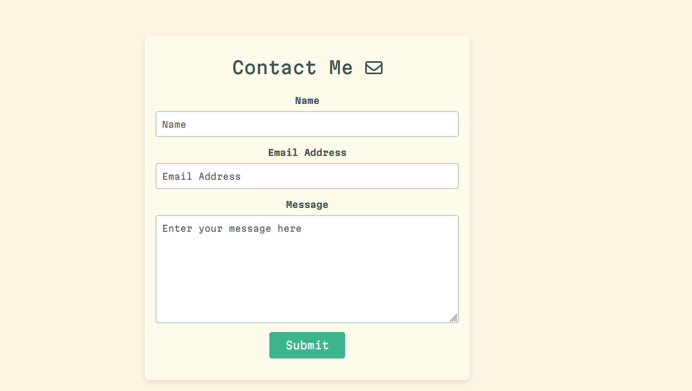

# Portfolio

   

This is my personal portfolio site. It can be viewed to learn more about me as a person, and a developer. It houses some of my previous works, skillsets, and contact information. 

## Table of Contents 

If your README is long, add a table of contents to make it easy for users to find what they need.

- [Installation](#installation)
- [Usage](#usage)
- [License](#license)
- [ContactMe] (#contactme)

## Installation

Installation is not necesarry, simply click this link:  https://mekennas-portfolio.netlify.app

## Usage

Learn about me

View my Projects

View my skills

and lastly, contact me!

## License

This project is licensed under MIT. Learn more at: https://choosealicense.com/licenses/mit/

## Contact Me

| Name          | Email                      | LinkedIn                         |
|---------------|----------------------------|-----------------------------------|
| Mekenna Baker    | mekenna.drabner@gmail.com     | [LinkedIn](https://www.linkedin.com/in/mekenna--baker/) |